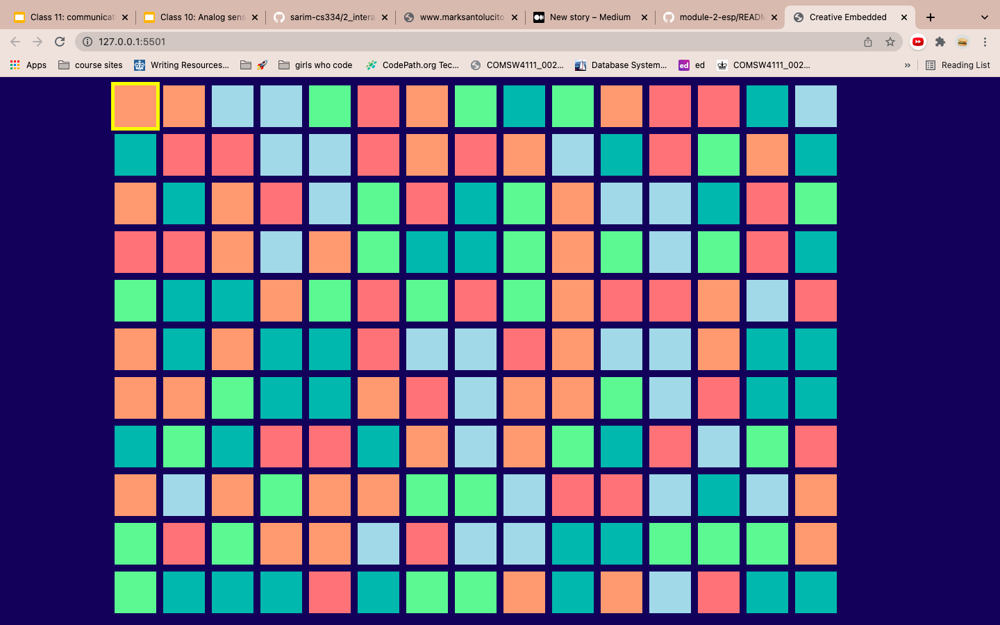
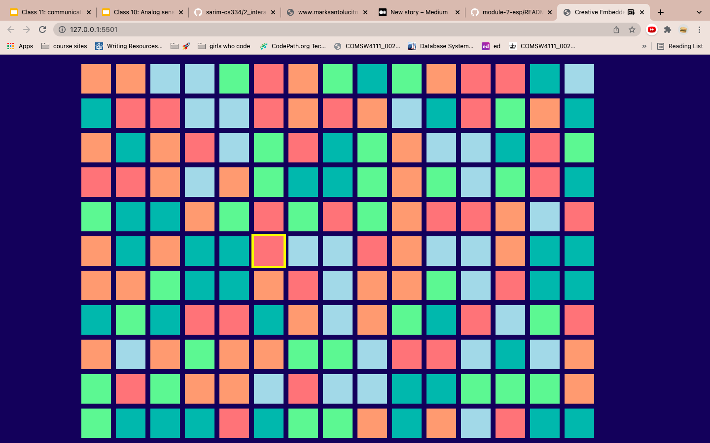
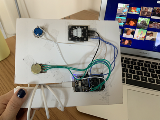

# module-2-esp

## Task details
Objective:
Create an interactive device with the provided hardware. From a hardware perspective, we were asked to connect the speficied components to the ESP32 and create an enclosure for the device. From a software perspective, we needed to write a program that collected sensor data and then use that data to create something interesting. 

## hardware 
- ESP32 TTGO T-display
- 5V battery (not necessary and was not used) 
- a button 
- a joystick
- a potentiometer

## demo 

before starting click the start button. you will be asked to indicate which port to open. 

using the joystick move to a square

tadaaa gifs!  

bigger gifs!   

biiiig gifs

## encpsulation 
  
I used a foam posterboard and an x-acto knife to cut the shapes and size that I wanted. The thickness of the posterboard meant that the majority of the hardware was inside of the board and only a small portion of it was exposed on the back. I carved out a space for the esp32 to fit into and I cut a path for the usbc to be connected to the esp32. It would have been great to add a 2 inch border around the back and cover the hardware but I didn't get to it. 

## hardware 
I used a mix of soldering wires directly onto the hardware and female to female wires. 
Button pin 26 
Joystick swpin 25, vrx 13, vry 27
potentiometer pin 12 

## software 
### arduino code 
for the arduino code I installed two different libraries AxisJoystick and JC Button. The way that I structured my code allowed me to recieve messages only when something was happening or changing. The joystick library could tell me the direction that the joystick was being moved in and I added a delay to recieve the messages at the rate that made sense for my project. The button library allowed me to only print a message when the button was pressed. The potentiometer code was structured in a way that it would print numbers 1-5 and would only print if there was a change from one number to another. All of this made it very easy to work with in my javascript code because each message resulted in an action. 

### javascript code
To begin I dynamically created a lot of boxes and each box stored a word that could be used as a search term and an incremental id that helped me identiy the box. When using the joystick I made it so that a change in position would add or subtract numbers in a way that would allow me to calculate which id resulted from the action. Using a css class I removed the class from the old square and added it to the newly calculated square with the matching id. This gave the effect of movement. With the button I made it so that when it was pressed it would again calculate the id that it was at in the moment, access the search term, call the Giphy API, clear all of the squares, and dynamically add the gifs to the screen. The potentiometer works by adding and removing classes that affect the width of the images. A higher number changes the class to a larger width. 
